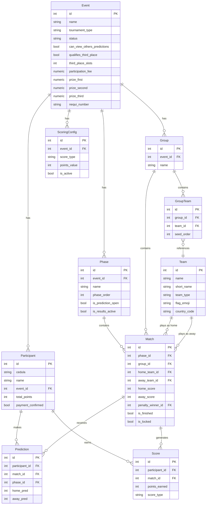

# 🏟️ Análisis Técnico — MundialApp

> Análisis de solo lectura. No se realizó ningún cambio en el proyecto.

---

## 1. Visión General

**MundialApp** es una aplicación web de tipo **polla/quiniela** de fútbol construida con Python (Flask) y PostgreSQL. Está actualmente en uso para el **Mundial 2026** (12 grupos, 48 equipos, 104 partidos). El proyecto es funcional, bien estructurado y listo para producción en Render.

| Atributo | Detalle |
|---|---|
| **Lenguaje** | Python 3.x |
| **Framework** | Flask 3.0.3 |
| **ORM** | SQLAlchemy 2.0 (Flask-SQLAlchemy 3.1) |
| **Base de datos** | PostgreSQL (psycopg3 / psycopg-binary) |
| **Frontend** | HTML5 + CSS Vanilla + Bootstrap 5.3 + JS Vanilla |
| **Servidor prod.** | Gunicorn + WhiteNoise |
| **Despliegue** | Render (cloud PaaS) |
| **Punto de entrada** | `run.py` → `app.create_app()` |

---

## 2. Estructura del Proyecto

```text
MundialApp/
├── app/
│   ├── __init__.py          ← Application Factory (53 líneas)
│   ├── models.py            ← 9 modelos SQLAlchemy (305 líneas)
│   ├── routes/
│   │   ├── admin.py         ← Blueprint /admin — CRUD completo (830 líneas)
│   │   ├── auth.py          ← Blueprint auth — login admin (60 líneas)
│   │   └── public.py        ← Blueprint público — participantes (515 líneas)
│   ├── services/
│   │   ├── scoring.py       ← Lógica de puntuación (103 líneas)
│   │   ├── standings.py     ← Tabla de grupos y top goleadores (127 líneas)
│   │   └── seeder.py        ← Catálogo inicial de equipos (239 líneas)
│   ├── static/
│   │   ├── css/custom.css   ← ~19 KB de estilos personalizados
│   │   └── js/app.js        ← Lógica de modales y validaciones
│   └── templates/
│       ├── base.html / admin_base.html
│       ├── admin/ (15 templates)
│       ├── auth/ (1 template)
│       └── public/ (10 templates)
├── config.py                ← Configuración obligatoria por env vars
├── run.py                   ← Entry point dev
├── requirements.txt         ← 28 dependencias (incl. Django 5.2 — ver nota)
├── .env.example             ← Guía de variables de entorno
├── seed_matches.py          ← Siembra de partidos
├── update_matches_v2.py     ← Actualiza fechas del fixture
├── migrate_to_postgres.py   ← Migración SQLite → PostgreSQL
└── fix_db.py / test_*.py   ← Utilidades de mantenimiento
```

---

## 3. Arquitectura y Flujo de Datos

```mermaid
flowchart TD
    U[Usuario/Participante] -->|GET/POST /evento/:id| PB[public_bp]
    A[Administrador] -->|GET/POST /admin/*| AB[admin_bp]
    AB -->|@require_admin| AUTH[auth_bp]
    PB --> MODELS[SQLAlchemy Models]
    AB --> MODELS
    MODELS --> PG[(PostgreSQL)]
    AB -->|Guardar resultado| SCORING[scoring.py]
    SCORING -->|Upsert Score| MODELS
    SCORING -->|Recalcula totales| MODELS
    PB -->|Grupos/Tabla| STANDINGS[standings.py]
    STANDINGS --> MODELS
```

### Blueprints registrados

| Blueprint | Prefijo | Responsabilidad |
|---|---|---|
| `auth_bp` | `/admin/login`, `/admin/logout` | Autenticación del administrador |
| `admin_bp` | `/admin/...` | CRUD completo de torneos |
| `public_bp` | `/`, `/evento/...` | Flujo de participantes |

---

## 4. Modelos de Base de Datos

### Diagrama Entidad-Relación



---

## 5. Rutas Públicas (`public_bp`)

| Método | URL | Función | Descripción |
|---|---|---|---|
| GET | `/` | `home()` | Lista de eventos activos |
| GET | `/evento/<id>` | `event_detail()` | Dashboard del participante |
| GET/POST | `/evento/<id>/validar` | `validate_participant()` | Gatekeeper: verifica cédula en 3 pasos |
| GET/POST | `/evento/<id>/participar` | `participate()` | Redirige al formulario de predicciones |
| GET | `/evento/<id>/predicciones/<cedula>` | `predictions_form()` | Formulario de predicciones |
| POST | `/evento/<id>/guardar-predicciones` | `save_predictions()` | Persiste predicciones (inmutables) |
| GET | `/evento/<id>/mis-predicciones/<cedula>` | `my_predictions()` | Historial propio o de otro |
| GET | `/evento/<id>/ranking` | `ranking()` | Ranking público |
| GET | `/evento/<id>/comparar/<cedula>` | `compare_predictions()` | Comparar predicciones con otro |
| GET | `/evento/<id>/grupos` | `group_standings()` | Tabla de posiciones por grupo |
| GET | `/evento/<id>/partido/<id>/aciertos` | `match_predictions()` | Detalle de predicciones por partido |

---

## 6. Rutas Administrativas (`admin_bp`)

| Módulo | Endpoints principales |
|---|---|
| **Dashboard** | `GET /admin/` |
| **Equipos** | CRUD + Seed `/admin/teams/*` |
| **Eventos** | CRUD + Detalle `/admin/events/*` |
| **Grupos** | CRUD + Asignar equipos + Generar fixture `/admin/events/<id>/groups` |
| **Fases** | CRUD + Toggle apertura `/admin/events/<id>/phases` |
| **Partidos** | CRUD + Lock toggle + Filtro por fase `/admin/events/<id>/matches` |
| **Resultados** | Ingreso de marcadores + cálculo automático `/admin/events/<id>/results` |
| **Puntuación** | Configuración de pts + Recalculación global `/admin/events/<id>/scoring` |
| **Participantes** | Lista + Filtros + Pago + Detalle `/admin/events/<id>/participants` |
| **Ranking Admin** | Vista administrativa `/admin/events/<id>/ranking` |

---

## 7. Lógica de Negocio

### 7.1 Flujo de Puntuación

```
Admin ingresa resultado real (home_score, away_score)
  → calculate_match_scores(match_id)
    → Obtiene ScoringConfig del evento
    → Para cada Prediction del partido:
        si pred exacto → exact_score (default: 3 pts)
        si ganador correcto → correct_winner (default: 1 pt)
        si ninguno → 0 pts
    → Upsert en tabla Score
    → recalculate_participant_totals(event_id)
      → SUM(Score.points_earned) por participante → Participant.total_points
```

### 7.2 Tabla de Standings

`standings.py::calculate_group_standings(group_id)` calcula dinámicamente a partir de partidos finalizados:
- Criterio de ordenación: **PTS desc → DIF desc → GF desc**
- Soporta clasificación de mejores terceros (`get_best_third_place_teams`)

### 7.3 Validación por Cédula (3 pasos)

```
POST /validar con {cedula}
  ├─ Participante existe → Login + sesión → /evento/<id>
  ├─ No existe + fase abierta + sin nombre → step='name' (formulario nombre)
  ├─ No existe + fase abierta + con nombre → Registro + sesión → /evento/<id>
  └─ No existe + fase cerrada → step='closed' (mensaje)
```

### 7.4 Predicciones Inmutables

Una vez enviadas, las predicciones no pueden modificarse:
- Control en `save_predictions()` via `participant.has_predicted_phase(phase_id)`
- Doble bloqueo: nivel de fase (`is_prediction_open`) + nivel de partido (`is_locked`)

---

## 8. Seguridad

| Aspecto | Implementación |
|---|---|
| **Autenticación admin** | Sesión Flask + decorador `@require_admin` |
| **Rate limiting login** | `@limiter.limit("5 per minute")` via Flask-Limiter |
| **CSRF** | Flask-WTF CSRFProtect activo en todos los formularios |
| **Proxy fix** | `ProxyFix` para Render (IP real, protocolo, host) |
| **Variables de entorno** | `_require_env()` — falla con `sys.exit(1)` si falta alguna |
| **Sesiones participantes** | Clave `participant_event_{event_id}` en sesión Flask |
| **Open Redirect** | `next_url` sin validación de dominio en `auth.login()` ⚠️ |
| **Inyección SQL** | Protegido por ORM SQLAlchemy (no hay SQL crudo) |

> [!WARNING]
> **Open Redirect potencial**: En `auth.py` línea 42, `next_url = request.args.get('next') or url_for('admin.dashboard')` no valida que la URL sea interna. Un atacante podría usar `?next=https://malicious.com`. Se recomienda validar que `next_url` empiece por `/`.

---

## 9. Configuración y Variables de Entorno

La clase `Config` en [config.py](file:///c:/Users/Programador.ti2/Desktop/DATA/Sf_git/Predicciones/MundialApp/config.py) requiere **4 variables de entorno obligatorias** (falla en arranque si alguna falta):

| Variable | Propósito |
|---|---|
| `SECRET_KEY` | Firma de cookies de sesión Flask |
| `DATABASE_URL` | URL de conexión PostgreSQL (normalizada a `postgresql+psycopg://`) |
| `ADMIN_USERNAME` | Usuario del panel `/admin/login` |
| `ADMIN_PASSWORD` | Contraseña del panel `/admin/login` |

El archivo [`.env.example`](file:///c:/Users/Programador.ti2/Desktop/DATA/Sf_git/Predicciones/MundialApp/.env.example) documenta correctamente estas variables.

---

## 10. Observaciones y Puntos de Atención

### ⚠️ Problemas detectados

| # | Severidad | Archivo | Descripción |
|---|---|---|---|
| 1 | 🟡 Media | `requirements.txt` | **Django 5.2 está listado** como dependencia pero no se usa en ningún archivo del proyecto. Esto agrega ~10 MB innecesarios al entorno. |
| 2 | 🟡 Media | `auth.py:42` | **Open Redirect**: `next_url` no se valida contra rutas internas. |
| 3 | 🟡 Media | `models.py` | `datetime.utcnow` está deprecado en Python 3.12+. Debería usarse `datetime.now(timezone.utc)`. |
| 4 | 🟢 Baja | `public.py:26` | `Event.query.get_or_404()` usa la API legacy de SQLAlchemy (deprecada en 2.0). Equivalente moderno: `db.get_or_404(Event, event_id)`. |
| 5 | 🟢 Baja | `scoring.py:63` | `datetime.utcnow()` mismo problema de deprecación. |
| 6 | 🟢 Baja | `public.py:64` | `datetime.now()` sin zona horaria. Podría dar resultados incorrectos si el servidor corre en un TZ distinto al de los usuarios. |
| 7 | 🟢 Baja | `admin.py:235` | El cálculo de `assigned_team_ids` hace múltiples queries dentro de un loop (N+1 pattern). Puede ser lento con muchos grupos. |

### ✅ Fortalezas del proyecto

| Aspecto | Detalle |
|---|---|
| **Arquitectura limpia** | Application Factory + Blueprints bien separados |
| **Cascada de borrado** | Eliminaciones manuales explícitas para evitar conflictos ORM |
| **Multi-torneo** | Un solo deploy soporta múltiples eventos independientes |
| **Configuración segura** | Sin valores por defecto en producción — falla rápido si falta config |
| **Recalculación global** | Cambiar la config de puntuación recalcula todo automáticamente |
| **UX participante** | Flujo de 3 pasos claro; predicciones inmutables garantizan integridad |
| **Penales** | `Match.get_result()` resuelve correctamente empates con penales |
| **Documentación** | README completo, manual técnico y de usuario incluidos |

---

## 11. Dependencias Notables

| Paquete | Versión | Rol |
|---|---|---|
| Flask | 3.0.3 | Framework web principal |
| Flask-SQLAlchemy | 3.1.1 | ORM |
| SQLAlchemy | 2.0.49 | ORM base |
| psycopg + psycopg-binary | 3.2.10 | Driver PostgreSQL v3 |
| Flask-WTF | 1.3.0 | CSRF protection |
| Flask-Limiter | 4.1.1 | Rate limiting |
| WhiteNoise | (sin pin) | Servicio de estáticos en producción |
| gunicorn | (sin pin) | Servidor WSGI producción |
| **Django** | **5.2** | ⚠️ **No utilizado** — remover |
| python-dotenv | 1.2.2 | Carga `.env` en desarrollo |
| Werkzeug | 3.0.3 | WSGI toolkit, ProxyFix |
| Pillow | 12.0.0 | Procesamiento de imágenes (no se usa visiblemente en rutas) |

---

## 12. Resumen Ejecutivo

**MundialApp** es un proyecto **bien construido y funcional**, con una arquitectura Flask estándar y correctamente separada por responsabilidades. El código es legible, con buenos comentarios en español y una lógica de negocio bien modelada.

Los **únicos problemas reales** son:
1. La dependencia `Django==5.2` que no se usa y encarece el build.
2. El Open Redirect en el login de admin (bajo riesgo real dado que el único usuario es el admin).
3. Los usos de `datetime.utcnow` deprecado (cosmético hasta Python 3.12+).

El resto son mejoras menores de modernización de API SQLAlchemy 2.0 que no afectan la funcionalidad.

---
*Análisis realizado el 25 de junio de 2026 — Solo lectura, sin modificaciones.*
