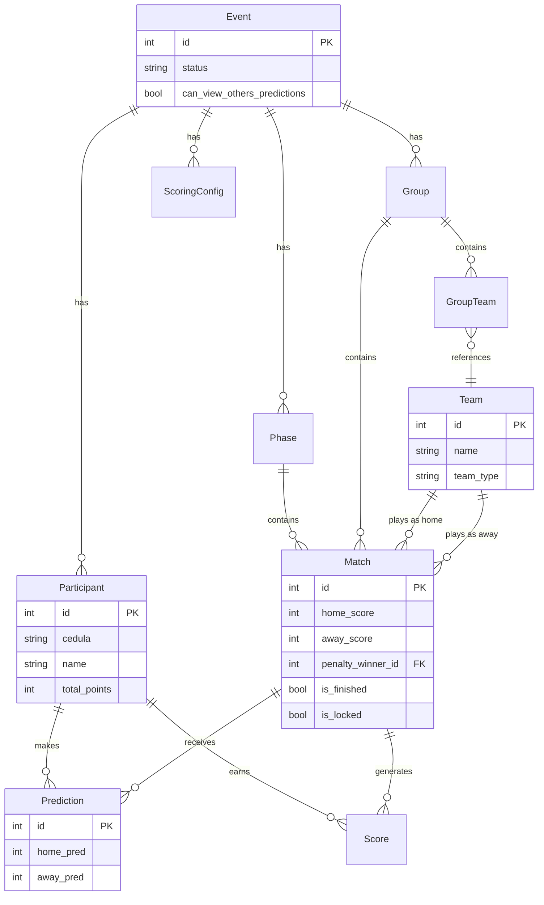

# 🏟️ Análisis Técnico — MundialApp (Actualizado)

> Análisis de solo lectura de la aplicación. Incluye la configuración del entorno de desarrollo local realizada el día de hoy. No se han modificado los archivos de código fuente.

---

## 1. Visión General

**MundialApp** es una aplicación web de tipo **polla/quiniela** de fútbol construida con Python (Flask) y PostgreSQL. Actualmente está estructurada para el **Mundial 2026** (12 grupos, 48 equipos, 104 partidos). El proyecto es funcional, está bien estructurado y se encuentra listo para producción en plataformas como Render.

| Atributo | Detalle |
|---|---|
| **Lenguaje** | Python 3.13 |
| **Framework** | Flask 3.0.3 |
| **ORM** | SQLAlchemy 2.0 (Flask-SQLAlchemy 3.1) |
| **Base de datos** | PostgreSQL 17 (psycopg3 / psycopg-binary) |
| **Frontend** | HTML5 + CSS Vanilla + Bootstrap 5.3 + JS Vanilla |
| **Servidor prod.** | Gunicorn + WhiteNoise |
| **Despliegue** | Render (cloud PaaS) / Supabase |
| **Punto de entrada** | `run.py` → `app.create_app()` |

---

## 2. Estructura del Proyecto y Entorno Local

```text
MundialApp/
├── .env                     ← (NUEVO) Configuración local (PostgreSQL local, Secrets)
├── venv/                    ← (NUEVO) Entorno virtual local de Python
├── app/
│   ├── __init__.py          ← Application Factory (Configuración de Flask, Limiter, DB)
│   ├── models.py            ← 9 modelos SQLAlchemy
│   ├── routes/
│   │   ├── admin.py         ← Blueprint /admin — CRUD completo (Panel de control)
│   │   ├── auth.py          ← Blueprint auth — Login y protección del administrador
│   │   └── public.py        ← Blueprint público — Flujo de los participantes y ranking
│   ├── services/
│   │   ├── scoring.py       ← Lógica de cálculo de puntos (exacto, ganador, etc.)
│   │   ├── standings.py     ← Lógica para calcular la tabla de grupos y posiciones
│   │   └── seeder.py        ← Catálogo inicial de equipos
│   ├── static/
│   │   └── css, js, img     ← Assets estáticos, CSS personalizado y lógica JS
│   └── templates/
│       ├── admin/, auth/, public/ ← Plantillas Jinja2 separadas por módulos
├── config.py                ← Validación y carga estricta de variables de entorno
├── run.py                   ← Punto de entrada (development server)
├── requirements.txt         ← Lista de dependencias del proyecto
└── utilidades (*.py)        ← Scripts de soporte (migración, fix_db, update_matches_v2)
```

### Configuración del Entorno Local (Actual)
El día de hoy se estableció un entorno de desarrollo local funcional sin modificar la base de código existente:
- **Base de Datos:** Se configuró una base de datos local `Predicciones` en un servicio de **PostgreSQL 17** corriendo en `localhost:5432`, con un usuario dedicado `predict`.
- **Entorno Virtual:** Se inicializó un `venv` y se instalaron las dependencias del archivo `requirements.txt`.
- **Servidor Activo:** La aplicación corre localmente sin errores en `http://127.0.0.1:5000/`.

---

## 3. Arquitectura y Flujo de Datos

```mermaid
flowchart TD
    U[Usuario/Participante] -->|GET/POST /evento/:id| PB[public_bp]
    A[Administrador] -->|GET/POST /admin/*| AB[admin_bp]
    AB -->|@require_admin| AUTH[auth_bp]
    PB --> MODELS[SQLAlchemy Models]
    AB --> MODELS
    MODELS --> PG[(PostgreSQL)]
    AB -->|Guardar resultado| SCORING[scoring.py]
    SCORING -->|Upsert Score| MODELS
    SCORING -->|Recalcula totales| MODELS
    PB -->|Grupos/Tabla| STANDINGS[standings.py]
    STANDINGS --> MODELS
```

### Blueprints registrados

| Blueprint | Prefijo | Responsabilidad |
|---|---|---|
| `auth_bp` | `/admin/login`, `/admin/logout` | Autenticación del administrador (Session-based) |
| `admin_bp` | `/admin/...` | CRUD completo de torneos, equipos, grupos, fases y partidos |
| `public_bp` | `/`, `/evento/...` | Dashboard público, validación de cédula y vista de predicciones |

---

## 4. Modelos de Base de Datos (Diagrama ER)



---

## 5. Lógica de Negocio Principal

### 5.1 Flujo de Puntuación (`scoring.py`)
Cuando el administrador ingresa un resultado real:
1. El sistema evalúa las predicciones de los participantes frente al resultado.
2. Otorga puntos configurables (por defecto: 3pts Marcador Exacto, 1pt Ganador Correcto).
3. Resuelve los empates en fases eliminatorias a través de `penalty_winner_id`.
4. Upsert automático en la tabla `Score` y recalculación de puntos totales del `Participant`.

### 5.2 Tabla de Posiciones (`standings.py`)
La tabla de posiciones de la fase de grupos es dinámica:
- Genera métricas en tiempo real: PJ, PG, PE, PP, GF, GC, DIF, PTS.
- Orden de clasificación estricto: **Puntos (PTS) > Diferencia de gol (DIF) > Goles a favor (GF)**.

### 5.3 Validación y Seguridad de Participantes
- **Gatekeeper Público:** El participante ingresa mediante el número de cédula en 3 pasos (verificación → registro opcional → dashboard).
- **Inmutabilidad:** Las predicciones guardadas no pueden ser modificadas por el usuario.
- **Doble Candado:** Las fases se pueden cerrar manualmente (`is_prediction_open`) y los partidos individualmente (`is_locked`).

---

## 6. Configuración y Seguridad

### 6.1 Manejo de Variables de Entorno (`config.py`)
La clase `Config` impone la presencia obligatoria de 4 variables de entorno críticas. Si faltan en producción, la app falla rápidamente (`sys.exit(1)`) para prevenir brechas de seguridad:
- `SECRET_KEY`: Para la firma de cookies de sesión.
- `DATABASE_URL`: Cadena de conexión a PostgreSQL.
- `ADMIN_USERNAME` & `ADMIN_PASSWORD`: Credenciales base del panel.

### 6.2 Fortalezas y Observaciones Técnicas
| Tipo | Observación | Detalle |
|---|---|---|
| ✅ | **Fortaleza** | **Arquitectura Limpia**: Separación clara por Blueprints y lógica de negocio. |
| ✅ | **Fortaleza** | **Eliminación Segura**: La función de borrado de Eventos y Grupos incluye "cascadas" explícitas en el código para prevenir conflictos con el ORM. |
| ⚠️ | **Observación** | **Dependencia Huérfana**: `Django==5.2` está en el `requirements.txt` pero la app usa puramente `Flask`. Podría eliminarse para aligerar el contenedor Docker/entorno virtual. |
| ⚠️ | **Observación** | **Redirección Abierta**: En `auth.py`, la redirección tras el login `next_url = request.args.get('next')` no valida que la URL solicitada sea del mismo origen. Riesgo bajo pero corregible. |
| ℹ️ | **Sugerencia** | **Deprecación de UTC**: `datetime.utcnow()` está deprecado en Python 3.12+ a favor de `datetime.now(timezone.utc)`. Como la máquina usa Python 3.13, arroja un warning de desarrollo. |

---
*Análisis técnico actualizado al 25 de junio de 2026. Refleja el estado de la base de código actual y del entorno de desarrollo local configurado.*
